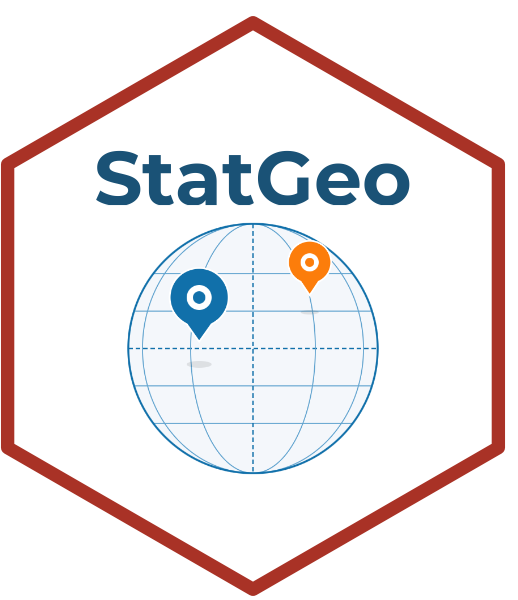

# StatGeo 

**StatGeo** es una plataforma interactiva para análisis espacial y SIG, parte del ecosistema [StatSuite](https://github.com/ManuelSpinola). Diseñada para enseñanza e investigación en ecología y ciencias de la biodiversidad.

## Módulos disponibles

| Módulo | Descripción |
|--------|-------------|
| Datos | Cargar datos vectoriales y raster |
| Vectorial | Análisis y visualización de datos vectoriales (sf) |
| Raster | Análisis y visualización de datos raster (terra) |
| Integración | Integración de capas vectoriales y raster |
| Estadísticas | Estadísticas espaciales |
| Acerca de | Información del proyecto |

## Instalación

```r
install.packages("remotes")
remotes::install_github("ManuelSpinola/StatGeo")
```

## Uso

```r
library(StatGeo)
StatGeo::run_app()
```

## Autor

**Manuel Spínola**  
ICOMVIS · Universidad Nacional · Costa Rica

## Licencia

MIT
